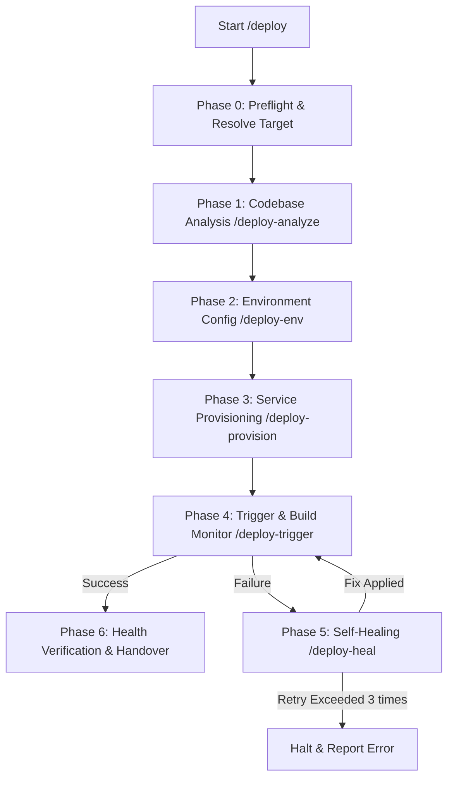

# Antigravity ADLC Deploy Pipeline

ชุดเครื่องมือ **DevOps & Auto-Deployment Pipeline** ที่ถูกดึงออกมาเฉพาะส่วน deploy จาก Antigravity ADLC Toolkit เพื่อใช้วิเคราะห์ ติดตั้ง และดูแลรักษาระบบ (Self-healing) บน Cloud provider หรือ VPS แบบอัตโนมัติ

---

## สารบัญ (Table of Contents)
1. [ภาพรวมของกระบวนการ (Pipeline Overview)](#ภาพรวมของกระบวนการ-pipeline-overview)
2. [โครงสร้างโฟลเดอร์ (Directory Structure)](#โครงสร้างโฟลเดอร์-directory-structure)
3. [การตั้งค่าปุ่มลัด Global (Global Setup & Short Commands)](#การตั้งค่าปุ่มลัด-global-global-setup--short-commands)
4. [รายละเอียดการทำงานแต่ละเฟส (Phase Details)](#รายละเอียดการทำงานแต่ละเฟส-phase-details)
5. [หลักการทำงานร่วมกัน (Core Ethos)](#หลักการทำงานร่วมกัน-core-ethos)

---

## ภาพรวมของกระบวนการ (Pipeline Overview)

เมื่อเรียกใช้งานคำสั่ง `/deploy` ระบบจะเรียกใช้งาน Sub-skills ต่าง ๆ ตามลำดับดังนี้:



---

## โครงสร้างโฟลเดอร์ (Directory Structure)

```text
AgentDeploy/
├── README.md               # เอกสารคู่มือชุดเครื่องมือชุดนี้
├── ETHOS.md                # กฎเหล็กและหลักการของ Agent
├── deploy/                 # คำสั่งหลัก /deploy (Orchestrator)
│   └── SKILL.md
├── deploy-analyze/         # คำสั่งวิเคราะห์ Codebase และสร้าง Config
│   └── SKILL.md
├── deploy-env/             # คำสั่งช่วยตรวจจับและตั้งค่า Environment Variables
│   └── SKILL.md
├── deploy-provision/       # คำสั่งสร้าง Service และฐานข้อมูลบน Cloud/VPS
│   └── SKILL.md
├── deploy-trigger/         # คำสั่งสั่ง Deploy และดึง Log มาวิเคราะห์
│   └── SKILL.md
├── deploy-heal/            # คำสั่งวิเคราะห์ Log ที่พังและเขียนโค้ดแก้ตัวเอง (Self-healing)
│   └── SKILL.md
└── partials/               # สคริปต์แชร์ใช้งานระหว่างสเต็ป
    └── ethos-include.sh
```

---

## การตั้งค่าปุ่มลัด Global (Global Setup & Short Commands)

เพื่อให้สามารถพิมพ์คำสั่งลัดเช่น `/deploy` หรือ `/deploy-heal` ใน IDE/AI Agent ของคุณ แล้วเครื่องมือพัฒนาเรียกใช้งานคำสั่งตามขั้นตอนของชุดเครื่องมือนี้โดยอัตโนมัติ ให้ทำการตั้งค่าตามคำแนะนำของเครื่องมือแต่ละค่ายดังนี้:

### 🌌 1. Antigravity (Google Gemini Agent)
* **ตำแหน่งไฟล์**: `~/.gemini/GEMINI.md` หรือระบุในโฟลเดอร์โปรเจกต์ที่ `.agent/rules/`
* **ตั้งค่าดังนี้** (เส้นทางระบุไปยังไดเรกทอรีนี้ `/Users/ben/Desktop/Work/AgentDeploy`):
```markdown
When the user inputs a short command, always execute the `view_file` tool in the background with `IsSkillFile: true` pointing to the corresponding Skill file before starting work:
- `/deploy` -> Read the file `/Users/ben/Desktop/Work/AgentDeploy/deploy/SKILL.md`
- `/deploy-analyze` -> Read the file `/Users/ben/Desktop/Work/AgentDeploy/deploy-analyze/SKILL.md`
- `/deploy-env` -> Read the file `/Users/ben/Desktop/Work/AgentDeploy/deploy-env/SKILL.md`
- `/deploy-provision` -> Read the file `/Users/ben/Desktop/Work/AgentDeploy/deploy-provision/SKILL.md`
- `/deploy-trigger` -> Read the file `/Users/ben/Desktop/Work/AgentDeploy/deploy-trigger/SKILL.md`
- `/deploy-heal` -> Read the file `/Users/ben/Desktop/Work/AgentDeploy/deploy-heal/SKILL.md`
```

### 🚀 2. Cursor
* **ตำแหน่งไฟล์**: สร้างไฟล์ `.cursorrules` ไว้ที่ Root ของโปรเจกต์
* **ตั้งค่าดังนี้**:
```markdown
When the user inputs a short command, always read the corresponding Skill file immediately before taking action or responding:
- `/deploy` -> Read the file `/Users/ben/Desktop/Work/AgentDeploy/deploy/SKILL.md`
- `/deploy-analyze` -> Read the file `/Users/ben/Desktop/Work/AgentDeploy/deploy-analyze/SKILL.md`
- `/deploy-env` -> Read the file `/Users/ben/Desktop/Work/AgentDeploy/deploy-env/SKILL.md`
- `/deploy-provision` -> Read the file `/Users/ben/Desktop/Work/AgentDeploy/deploy-provision/SKILL.md`
- `/deploy-trigger` -> Read the file `/Users/ben/Desktop/Work/AgentDeploy/deploy-trigger/SKILL.md`
- `/deploy-heal` -> Read the file `/Users/ben/Desktop/Work/AgentDeploy/deploy-heal/SKILL.md`
```

### 🏄 3. Windsurf
* **ตำแหน่งไฟล์**: สร้างไฟล์ `.windsurfrules` ไว้ที่ Root ของโปรเจกต์
* **ตั้งค่าดังนี้**:
```markdown
When the user inputs a short command or references these deployment processes, read the corresponding Skill file immediately before proceeding:
- `/deploy` -> Read the file `/Users/ben/Desktop/Work/AgentDeploy/deploy/SKILL.md`
- `/deploy-analyze` -> Read the file `/Users/ben/Desktop/Work/AgentDeploy/deploy-analyze/SKILL.md`
- `/deploy-env` -> Read the file `/Users/ben/Desktop/Work/AgentDeploy/deploy-env/SKILL.md`
- `/deploy-provision` -> Read the file `/Users/ben/Desktop/Work/AgentDeploy/deploy-provision/SKILL.md`
- `/deploy-trigger` -> Read the file `/Users/ben/Desktop/Work/AgentDeploy/deploy-trigger/SKILL.md`
- `/deploy-heal` -> Read the file `/Users/ben/Desktop/Work/AgentDeploy/deploy-heal/SKILL.md`
```

### 🛠️ 4. Roo Code / Cline (VS Code Extension)
* **ตำแหน่งไฟล์**: สร้างไฟล์ `.clinerules` ไว้ที่ Root ของโปรเจกต์
* **ตั้งค่าดังนี้**:
```markdown
When the user inputs a short command, read the corresponding Skill file before starting work:
- `/deploy` -> Read the file `/Users/ben/Desktop/Work/AgentDeploy/deploy/SKILL.md`
- `/deploy-analyze` -> Read the file `/Users/ben/Desktop/Work/AgentDeploy/deploy-analyze/SKILL.md`
- `/deploy-env` -> Read the file `/Users/ben/Desktop/Work/AgentDeploy/deploy-env/SKILL.md`
- `/deploy-provision` -> Read the file `/Users/ben/Desktop/Work/AgentDeploy/deploy-provision/SKILL.md`
- `/deploy-trigger` -> Read the file `/Users/ben/Desktop/Work/AgentDeploy/deploy-trigger/SKILL.md`
- `/deploy-heal` -> Read the file `/Users/ben/Desktop/Work/AgentDeploy/deploy-heal/SKILL.md`
```

### 🐙 5. GitHub Copilot
* **ตำแหน่งไฟล์**: สร้างไฟล์ `.github/copilot-instructions.md` ไว้ที่ Root ของโปรเจกต์
* **ตั้งค่าดังนี้**:
```markdown
When the user references these custom slash commands, read the content of the referenced file to understand the skill context:
- `/deploy` -> Read the file `/Users/ben/Desktop/Work/AgentDeploy/deploy/SKILL.md`
- `/deploy-analyze` -> Read the file `/Users/ben/Desktop/Work/AgentDeploy/deploy-analyze/SKILL.md`
- `/deploy-env` -> Read the file `/Users/ben/Desktop/Work/AgentDeploy/deploy-env/SKILL.md`
- `/deploy-provision` -> Read the file `/Users/ben/Desktop/Work/AgentDeploy/deploy-provision/SKILL.md`
- `/deploy-trigger` -> Read the file `/Users/ben/Desktop/Work/AgentDeploy/deploy-trigger/SKILL.md`
- `/deploy-heal` -> Read the file `/Users/ben/Desktop/Work/AgentDeploy/deploy-heal/SKILL.md`
```

### 💎 6. JetBrains AI Assistant (IntelliJ, WebStorm, PyCharm, etc.)
* **ตำแหน่งไฟล์**: ระบุคู่มือใน **System Prompt** / **Prompt Library** หรือสร้างไฟล์ `.github/copilot-instructions.md` ที่ Root ของโปรเจกต์
* **ตั้งค่าดังนี้**:
```markdown
When the user inputs a short command, refer to the corresponding Skill file:
- `/deploy` -> Read the file `/Users/ben/Desktop/Work/AgentDeploy/deploy/SKILL.md`
- `/deploy-analyze` -> Read the file `/Users/ben/Desktop/Work/AgentDeploy/deploy-analyze/SKILL.md`
- `/deploy-env` -> Read the file `/Users/ben/Desktop/Work/AgentDeploy/deploy-env/SKILL.md`
- `/deploy-provision` -> Read the file `/Users/ben/Desktop/Work/AgentDeploy/deploy-provision/SKILL.md`
- `/deploy-trigger` -> Read the file `/Users/ben/Desktop/Work/AgentDeploy/deploy-trigger/SKILL.md`
- `/deploy-heal` -> Read the file `/Users/ben/Desktop/Work/AgentDeploy/deploy-heal/SKILL.md`
```

---

## รายละเอียดการทำงานแต่ละเฟส (Phase Details)

### 🚀 `/deploy` (Orchestrator)
ทำหน้าที่ประสานงานระหว่าง sub-skills ทั้งหมดตั้งแต่ตรวจเช็ค credential ไปจนถึง verify เว็บไซต์หลังปล่อยขึ้นเซิร์ฟเวอร์สำเร็จ

### 🔍 `/deploy-analyze`
* วิเคราะห์เทคโนโลยีที่ใช้ (Node.js, Python, Go, Rust, Ruby)
* ตรวจหา Port ที่ระบบใช้งาน และฐานข้อมูลที่ต้องใช้
* ทำการสร้างไฟล์ `Dockerfile`, `docker-compose.yml` หรือ `nixpacks.toml` ให้โดยอัตโนมัติหากยังไม่มี

### 🔑 `/deploy-env`
* ค้นหาไฟล์ `.env.example` หรือสแกนโค้ดหาตัวแปรแวดล้อม
* สรุปรายการ และขอให้ผู้ใช้งานกรอกค่าความลับ (Secrets) หรือค่าตั้งต้นอย่างปลอดภัย

### 🛠️ `/deploy-provision`
* เชื่อมต่อไปยัง Coolify API, Railway CLI หรือ VPS (ผ่าน SSH)
* สร้างฐานข้อมูล (PostgreSQL, Redis, MySQL ฯลฯ)
* ผูกโดเมน ตั้งค่า Port forwarding และแนบ Environment variables ทั้งหมดเข้ากับแอปพลิเคชัน

### 🎬 `/deploy-trigger`
* สั่งเริ่มทำการ Build และ Deploy บน Cloud/VPS
* แสดงผล Log การสร้างและรันเซิร์ฟเวอร์แบบ Real-time
* ยิง HTTP GET ไปทดสอบ URL เพื่อเช็คผลลัพธ์ (Health check)

### 🏥 `/deploy-heal` (Self-Healing)
* หากการ Deploy ล้มเหลว ระบบจะดึง Log ความพิดพลาดมาวิเคราะห์หาสาเหตุ
* ทำการแก้ไขโค้ดหรือไฟล์ Config ที่เกี่ยวข้องในระบบทันที
* สั่ง Git Commit & Push เพื่อยิงขึ้นไปรันใหม่อัตโนมัติ (รองรับสูงสุด 3 รอบป้องกัน Loop)

---

## หลักการทำงานร่วมกัน (Core Ethos)

ดูรายละเอียดหลักการปฏิบัติงานได้ที่ [ETHOS.md](file:///Users/ben/Desktop/Work/AgentDeploy/ETHOS.md)
