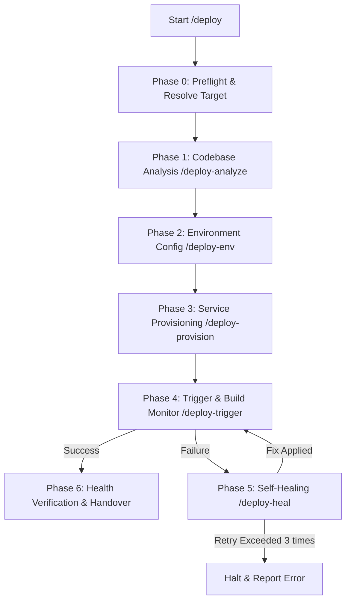

# ADLC Auto-Deploy Pipeline

A **DevOps & Auto-Deployment Pipeline** toolset for automated codebase analysis, provisioning, deployment, and self-healing system recovery on cloud providers or VPS environments.

---

## Table of Contents
1. [Pipeline Overview](#pipeline-overview)
2. [Directory Structure](#directory-structure)
3. [Global Setup & Short Commands](#global-setup--short-commands)
4. [Phase Details](#phase-details)
5. [Core Ethos](#core-ethos)

---

## Pipeline Overview

When executing the `/deploy` command, the system triggers sub-skills sequentially as follows:



---

## Directory Structure

```text
AgentDeploy/
├── README.md               # Toolset documentation
├── ETHOS.md                # Agent rules and core principles
├── deploy/                 # Main orchestrator /deploy
│   └── SKILL.md
├── deploy-analyze/         # Codebase analysis & config generator
│   └── SKILL.md
├── deploy-env/             # Environment variable detection & setup helper
│   └── SKILL.md
├── deploy-provision/       # Service & database provisioning on Cloud/VPS
│   └── SKILL.md
├── deploy-trigger/         # Build execution & log analyzer
│   └── SKILL.md
├── deploy-heal/            # Failure analysis & self-healing patcher
│   └── SKILL.md
└── partials/               # Shared scripts across phases
    └── ethos-include.sh
```

---

## Global Setup & Short Commands

To execute short commands such as `/deploy` or `/deploy-heal` in your IDE/AI Agent and have the development tools automatically load this toolset's sequence, follow the configuration instructions for your preferred AI tool below:

### 🌌 1. Google Gemini / Custom Agent Rules
* **File Location**: `~/.gemini/GEMINI.md` or locally in `.agent/rules/` within your project folder.
* **Configuration** (Paths mapped to this directory `/path/to/AgentDeploy`):
```markdown
When the user inputs a short command, always execute the `view_file` tool in the background with `IsSkillFile: true` pointing to the corresponding Skill file before starting work:
- `/deploy` -> Read the file `/path/to/AgentDeploy/deploy/SKILL.md`
- `/deploy-analyze` -> Read the file `/path/to/AgentDeploy/deploy-analyze/SKILL.md`
- `/deploy-env` -> Read the file `/path/to/AgentDeploy/deploy-env/SKILL.md`
- `/deploy-provision` -> Read the file `/path/to/AgentDeploy/deploy-provision/SKILL.md`
- `/deploy-trigger` -> Read the file `/path/to/AgentDeploy/deploy-trigger/SKILL.md`
- `/deploy-heal` -> Read the file `/path/to/AgentDeploy/deploy-heal/SKILL.md`
```

### 🚀 2. Cursor
* **File Location**: Create a `.cursorrules` file at the root of your project.
* **Configuration**:
```markdown
When the user inputs a short command, always read the corresponding Skill file immediately before taking action or responding:
- `/deploy` -> Read the file `/path/to/AgentDeploy/deploy/SKILL.md`
- `/deploy-analyze` -> Read the file `/path/to/AgentDeploy/deploy-analyze/SKILL.md`
- `/deploy-env` -> Read the file `/path/to/AgentDeploy/deploy-env/SKILL.md`
- `/deploy-provision` -> Read the file `/path/to/AgentDeploy/deploy-provision/SKILL.md`
- `/deploy-trigger` -> Read the file `/path/to/AgentDeploy/deploy-trigger/SKILL.md`
- `/deploy-heal` -> Read the file `/path/to/AgentDeploy/deploy-heal/SKILL.md`
```

### 🏄 3. Windsurf
* **File Location**: Create a `.windsurfrules` file at the root of your project.
* **Configuration**:
```markdown
When the user inputs a short command or references these deployment processes, read the corresponding Skill file immediately before proceeding:
- `/deploy` -> Read the file `/path/to/AgentDeploy/deploy/SKILL.md`
- `/deploy-analyze` -> Read the file `/path/to/AgentDeploy/deploy-analyze/SKILL.md`
- `/deploy-env` -> Read the file `/path/to/AgentDeploy/deploy-env/SKILL.md`
- `/deploy-provision` -> Read the file `/path/to/AgentDeploy/deploy-provision/SKILL.md`
- `/deploy-trigger` -> Read the file `/path/to/AgentDeploy/deploy-trigger/SKILL.md`
- `/deploy-heal` -> Read the file `/path/to/AgentDeploy/deploy-heal/SKILL.md`
```

### 🛠️ 4. Roo Code / Cline (VS Code Extension)
* **File Location**: Create a `.clinerules` file at the root of your project.
* **Configuration**:
```markdown
When the user inputs a short command, read the corresponding Skill file before starting work:
- `/deploy` -> Read the file `/path/to/AgentDeploy/deploy/SKILL.md`
- `/deploy-analyze` -> Read the file `/path/to/AgentDeploy/deploy-analyze/SKILL.md`
- `/deploy-env` -> Read the file `/path/to/AgentDeploy/deploy-env/SKILL.md`
- `/deploy-provision` -> Read the file `/path/to/AgentDeploy/deploy-provision/SKILL.md`
- `/deploy-trigger` -> Read the file `/path/to/AgentDeploy/deploy-trigger/SKILL.md`
- `/deploy-heal` -> Read the file `/path/to/AgentDeploy/deploy-heal/SKILL.md`
```

### 🐙 5. GitHub Copilot
* **File Location**: Create a `.github/copilot-instructions.md` file at the root of your project.
* **Configuration**:
```markdown
When the user references these custom slash commands, read the content of the referenced file to understand the skill context:
- `/deploy` -> Read the file `/path/to/AgentDeploy/deploy/SKILL.md`
- `/deploy-analyze` -> Read the file `/path/to/AgentDeploy/deploy-analyze/SKILL.md`
- `/deploy-env` -> Read the file `/path/to/AgentDeploy/deploy-env/SKILL.md`
- `/deploy-provision` -> Read the file `/path/to/AgentDeploy/deploy-provision/SKILL.md`
- `/deploy-trigger` -> Read the file `/path/to/AgentDeploy/deploy-trigger/SKILL.md`
- `/deploy-heal` -> Read the file `/path/to/AgentDeploy/deploy-heal/SKILL.md`
```

### 💎 6. JetBrains AI Assistant (IntelliJ, WebStorm, PyCharm, etc.)
* **File Location**: Add the rules to your custom **System Prompt** / **Prompt Library**, or create a `.github/copilot-instructions.md` file at the root of your project.
* **Configuration**:
```markdown
When the user inputs a short command, refer to the corresponding Skill file:
- `/deploy` -> Read the file `/path/to/AgentDeploy/deploy/SKILL.md`
- `/deploy-analyze` -> Read the file `/path/to/AgentDeploy/deploy-analyze/SKILL.md`
- `/deploy-env` -> Read the file `/path/to/AgentDeploy/deploy-env/SKILL.md`
- `/deploy-provision` -> Read the file `/path/to/AgentDeploy/deploy-provision/SKILL.md`
- `/deploy-trigger` -> Read the file `/path/to/AgentDeploy/deploy-trigger/SKILL.md`
- `/deploy-heal` -> Read the file `/path/to/AgentDeploy/deploy-heal/SKILL.md`
```

### 🤖 7. Claude Code
* **File Location**: Create a `.clauderules` file at the root of your project.
* **Configuration**:
```markdown
When the user inputs a short command, always read the corresponding Skill file immediately before taking action or responding:
- `/deploy` -> Read the file `/path/to/AgentDeploy/deploy/SKILL.md`
- `/deploy-analyze` -> Read the file `/path/to/AgentDeploy/deploy-analyze/SKILL.md`
- `/deploy-env` -> Read the file `/path/to/AgentDeploy/deploy-env/SKILL.md`
- `/deploy-provision` -> Read the file `/path/to/AgentDeploy/deploy-provision/SKILL.md`
- `/deploy-trigger` -> Read the file `/path/to/AgentDeploy/deploy-trigger/SKILL.md`
- `/deploy-heal` -> Read the file `/path/to/AgentDeploy/deploy-heal/SKILL.md`
```

---

## Phase Details

### 🚀 `/deploy` (Orchestrator)
Coordinates the execution of all sub-skills, starting from credential checks to final deployment verification.

### 🔍 `/deploy-analyze`
* Analyzes the active tech stack (Node.js, Python, Go, Rust, Ruby, etc.).
* Detects network ports used by the application and required databases.
* Automatically generates a `Dockerfile`, `docker-compose.yml`, or `nixpacks.toml` if they do not already exist.

### 🔑 `/deploy-env`
* Locates `.env.example` files or scans source code for environment variables.
* Summarizes the required environment variables and prompts the user to enter secrets/default configurations securely.

### 🛠️ `/deploy-provision`
* Connects to deployment engines (Coolify API, Railway CLI) or VPS (via SSH).
* Provisions databases (PostgreSQL, Redis, MySQL, etc.) as identified in the analysis phase.
* Binds domains, configures port forwarding, and attaches environment variables to the app service.

### 🎬 `/deploy-trigger`
* Triggers the build and deployment process on Cloud/VPS.
* Streams build logs and server outputs in real-time.
* Performs a health check by sending HTTP GET requests to the deployment URL.

### 🏥 `/deploy-heal` (Self-Healing)
* If the deployment fails, the agent fetches and analyzes the error logs.
* Instantly fixes root causes in source code or configuration files.
* Commits, pushes changes, and triggers a redeployment automatically (limits to 3 attempts to prevent infinite loops).

---

## Core Ethos

For developer guidelines and standard operating procedures, please refer to [ETHOS.md](ETHOS.md).
